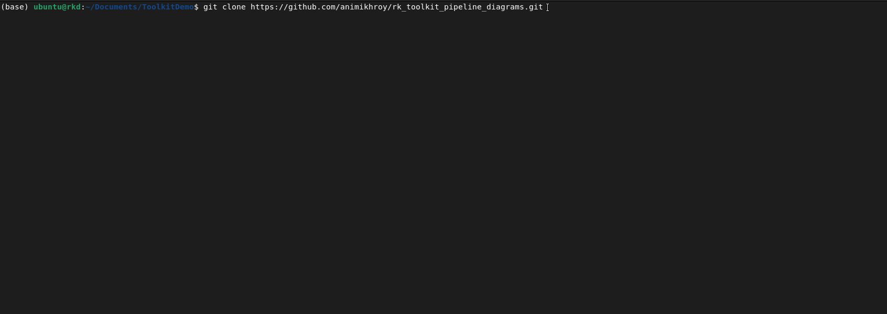

====================================
Installing the R-K Toolkit and Usage
====================================

Installation
------------

The R-K Toolkit depends on a few scientific libraries, which come preinstalled with environments like Anaconda. 
The R-K Toolkit also depends on :code:`nevergrad` library which can be installed via :code:`pip` as below.

.. code-block:: python

    pip install nevergrad

More information about :code:`nevergrad` can be found at their official `Git Repository <https://facebookresearch.github.io/nevergrad/>`_ .

The R-K Toolkit can be installed using :code:`pip` from the toolkit folder as given below.

.. code-block::python
 
    python -m pip install .

This will install the R-K Toolkit package. A virtualenv may also be used to install for a specific project.

The R-K Toolkit can also be installed from the main project `repository <https://github.com/animikhroy/rk_toolkit_pipeline_diagrams>`_ through the following steps:

1. Clone the repository via the following command:

.. code-block::

    git clone https://github.com/animikhroy/rk_toolkit_pipeline_diagrams.git

2. Change to the repository folder via the terminal/command prompt:

.. code-block::

    cd rk_toolkit_pipeline_diagrams

3. As R-K Toolkit is a submodule, we need to pull the submodule to our local repository. This is done by the following command:

.. code-block::

    git submodule update --init --recursive

4. Change to the R-K Toolkit directory (located as /01_rk_toolkit) via the terminal/command prompt:

.. code-block::

    cd 01_rk_toolkit

5. **[Optional]** Before installing, if we want to install in a virtual environment, ensure that we are in the virtual environment, else create one.

6. Install the R-K toolkit using :code:`pip` as mentioned above.

The full installation process:

Usage
-----

The following is an example usage from the Jupyter `notebooks <https://github.com/animikhroy/rk_toolkit_pipeline_diagrams/tree/main/02_notebooks>`_:

..image:
