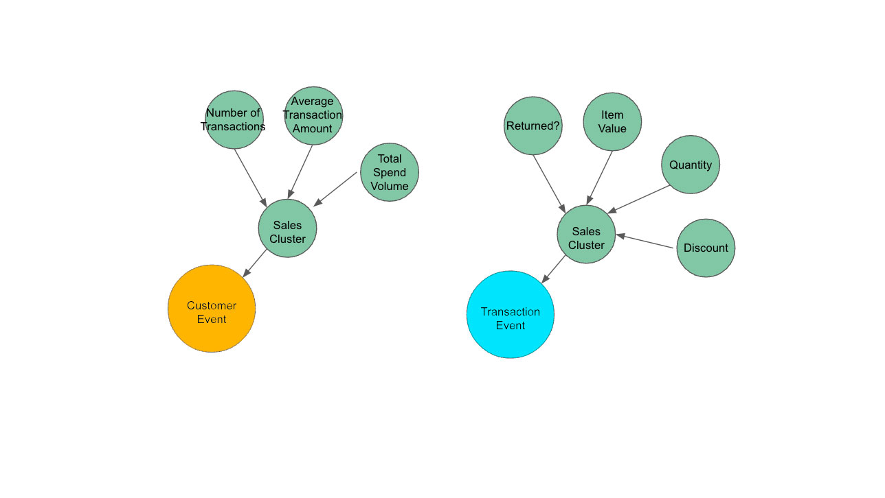

==========
R-K Model
==========

An R-K Model is the fundamental building block of any R-K Diagram. It represents a composite object that can be used to render an R-K Diagram using appropriate filter and linker functions as defined according to the specific use-case. In other words, an R-K Diagram is the rendering of an R-K Model, and the R-K Model serves as the underlying data structure for that render.

All R-K Models must contain the following 3 components:

1. Structural Graph
2. Node Masks
3. Derived Links

1. Structural Graph
+++++++++++++++++++

The structural graph (S) is the base graph derived through the Hierarchical Embedding Function, also known as the structural graph. The structural graph provides the baseline ontological structure that forms the basis for all other transformations in the pipeline. Because node masks are reductive operations, the number of nodes in the structural graph represents the maximal number of nodes in the R-K Diagram such that :math: `|nodes| ∈ S >= |nodes| ∈ R − K Diagram`. 
The structural graph however does not represent that maximal number of edges. The number of possible edges in the R-K Diagram is bounded by the number of combinations of nodes in the structural graph.

.. automodule:: rktoolkit.models.rkmodel
   :members:
   :undoc-members:

**Hierarchical Graph**
----------------------

.. autoclass:: rktoolkit.models.graph.HierarchicalGraph
    :members:
    :undoc-members:

**Graph**
---------

.. autoclass:: rktoolkit.models.graph.Graph
    :members:
    :undoc-members:

**Edge**
--------

.. autoclass:: rktoolkit.models.graph.Edge
    :members:
    :undoc-members:

**Vertex**
----------

.. autoclass:: rktoolkit.models.graph.Vertex
    :members:
    :undoc-members:

**Node**
--------

.. autoclass:: rktoolkit.models.graph.Node
    :members:
    :undoc-members:

2. Node Masks
+++++++++++++

.. autoclass:: rktoolkit.models.graph.NodeMask
    :members:
    :undoc-members:

3. Derived Links
++++++++++++++++

**Linkage Function**
--------------------

.. autoclass:: rktoolkit.models.linkage.LinkageFunction
    :members:
    :undoc-members:

.. image:: ../../imgs/LinkageFunction.png
    

**ChoiceOfLens**
----------------

The choice of lens is critical for the basis of ontology and the R-K Model. It is the lens according to which an “event” is determined from, such that “Lens” defines a central-event node called the root node such that all branching nodes and the hierarchy are birthed from the choice of lens. As an example, in the store sales data, there may exist many lenses, such as a Customer lens, or a Transaction lens. Each lens would provide unique events associated with such events, with different structural graphs as the foundation for each R-K Diagram.

The diagrams below show the effect of the lens on the structural graph. To the left, a lens is chosen from a specific “Customer” event. To the right, a lens is chosen from a “transactions” perspective. The values and metrics associated with each lens are related to the respective lens.

TODO: Add info about it from notebook

**R-K Model Visualizer**
++++++++++++++++++++++++

.. autoclass:: rktoolkit.visualizers.visualizer.RKModelVisualizer
    :members:
    :undoc-members:
    
R-K Diagram
===========

An R-K Diagram is the manifestation of an R-K Model upon the application of appropriate “leaf-linker” functions and “range-filter” functions to these models based on specific domain knowledge according to the user's discretion. It contains the positions of each node, information about how to represent such nodes, as well as edge visualizations. Given any R-K Model, an R-K Diagram serves as a render of the R-K Model in 2D or 3D space. As an R-K Model is a multi-dimensional representation of data, an R-K diagram can display many dimensions in 2D, without data loss that a typical projection model would have. To work effectively and render efficiently with optimal compute power, the visualized space is always kept at nD < 4.

We tend to use a radial layout for our demonstrations, but any graph layout can be used, with a preference toward deterministic layouts. We prefer deterministic layouts, because it allows easier qualitative comparisons of R-K Diagrams to analyze their similarity and  differences.The R-K Pipeline uses code package: :code:`pyplot` to render these final visualizations in 2D using mathematical projection and isometric-compression techniques.

Refer to :ref: `Visualizer package <rktoolkit.visualizers>` for more visualizer modules and to the `General Applications <https://github.com/animikhroy/rk_toolkit_pipeline_diagrams/tree/main/02_notebooks/rk_general_applications>`_ and `Examples <https://github.com/animikhroy/rk_toolkit_pipeline_diagrams/tree/main/02_notebooks/rk_gw_mma>`_ for usage.

.. autoclass:: rktoolkit.visualizers.visualizer.RKDiagram
    :members:
    :undoc-members:

