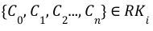
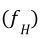
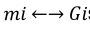
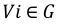
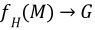
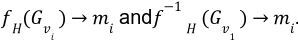
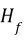

===================
R-K Pipeline
===================

An R-K Pipeline is a unidirectional pipeline that builds an R-K Model from an incoming dataset or data stream as a precursor to generate domain specific R-K Diagrams with appropriate “range-filters” and “leaf-linkers''. An R-K Pipeline, involves the process of transforming an NxM Tensor  with 3 or more independent physical/ontological variables into an R-K Model which can then be visualized as an R-K Diagram with the help of domain specific filter and linker functions.
At a base level, the R-K Pipeline can be understood as a Directed Acyclic Graph (DAG), which provides transformational components that result in a composite model we call an R-K Model. Transforms in an R-K Pipeline can be chained against each other, as long as egress from one component complies with the ingress specifications from another component. We can mathematically represent this with the following representation: |CRK| where |Ci| represents a pipeline component and the egress of |Ci| is compliant with a set of constraints imposed by |Ci1|'s ingress. There are a few novel concepts and objects within the pipeline as well as the entire pipeline itself, by virtue of its components and ordering, that provide a novel approach toward topological graph theory and data analysis.

.. |Ci| image:: ../../imgs/Pipe/Pipe2.jpg

.. |Ci1| image:: ../../imgs/Pipe/Pipe3.jpg

The figure below demonstrates the various steps of an R-K Pipeline w.r.t. the data-flow as shown:

.. image:: ../../imgs/rk-flow.png
   :width: 600

Composed together are the following steps:

1. Preprocess Steps
2. Localization Algorithm
3. Hierarchical Feature Extraction Nodes
4. Filter Functions
5. Linkage Functions

Composed together, these independent component modules of the R-K Pipeline can be triggered in sequence to synthesize an R-K Model as a precursor to generating R-K Diagrams.

.. automodule:: rktoolkit.models.pipeline 
   :members:
   :undoc-members:

Base Ontology and Hierarchical Transform Graphs
--------------------------------------------------

An ontology in the context of an R-K Model, describes the relationship between two or more measures in the form of a hierarchy. Ontological frameworks are domain dependent and have numerous advantages, such that it makes domain assumptions on data explicit and/or to share a common understanding of structural information across metrics. 

In an R-K Pipeline the ontologies can either be learned via covariance and correlation associations made automatically using the Correlation HTG module from relational databases which represent physical parameters without any explicit framework for determining dependence and relationships. These domain ontologies can also be inherited in the R-K Pipeline from Ontological databases available online or JSON files which contain a particular defined hierarchy. There are numerous ontological databases available for describing relationships between known domains which can be directly applied to the R-K Pipeline to build corresponding models based on the choice of a particular lens function. The Web Ontology Language (OWL) is a specific set of web standards and language devised to standardize ontologies through OWL Documents which can be applied to the R-K Pipeline.

Classes used to create Base Ontology Transform and Correlated Hierarchical Transform Graphs. 

.. automodule:: rktoolkit.functions.htg_transformers
   :members:
   :undoc-members:

Hierarchical Embedding Function
--------------------------------

In the R-K Pipeline, a Hierarchical Embedding Function |fH| generates a graph G from a set of measures M such that the resulting graph G, is a DAG which represents a bijective mapping between |migi| such that all |vig| can be traced back to the original value in the dataset, where V is a vertex. More succinctly, |fHMG| such that |fHGvi|. The advantage of this requirement is that any structural graph can be inverted back into original measures used to generate the graph.

Across the pipeline, the graph generated by |Hf| is referenced as a Structural Graph (S). The structural graph provides the baseline ontological structure that forms the basis for all other transformations in the pipeline.

Isometric Compressions
----------------------

Unlike standard dimensionality reduction techniques, compression techniques applied to the R-K Diagrams do not lose resolution in the data and can also maintain a consistent number of dimensions (2 or 3) of diagrams regardless of the number of model dimensions. 

This makes it far easier to evaluate models in higher dimensional space qualitatively without data loss and is one of the primary advantages to the R-K Pipeline. We used the steps outlined in Isometric Compressions,Inverse Function, and Decompression for graph compression.

We used a limited compression technique via a 1 degree leaf compression technique, which compressed all 1 degree or “unlinked” leafs into a single compressed leaf branching from the same parent. The steps are maintained internally so that the original structural graph can be reconstructed from the compressed version, thereby providing the inverse transformation.

TODO: Need to add from the notebook after talking with andorsk

