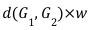
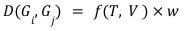
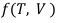
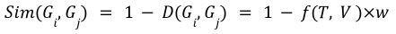
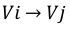
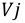
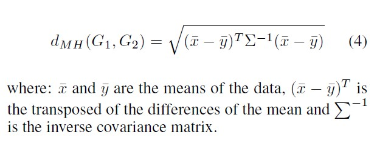
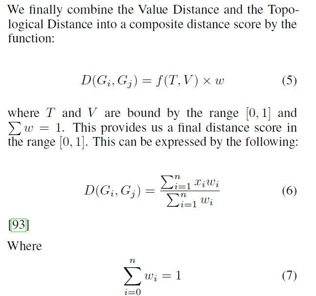
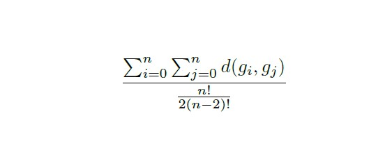

.. _rktoolkit.functions:

Functions package
===========================

.. _rktoolkit.functions.distance:

Distance Module
---------------
R-K Distance is a composite distance function that measures the distance and similarity between any two R-K Diagrams in a metric built to measure homeomorphism using a combination of Topological Distance as an extension of Jaccard Distance & Value/Magnitudinal Distance based on an extension of Mahalanobis Distance. R-K Distance is critical to the tuning and understanding of R-K Diagrams for its ability to quantitatively measure divergence (and its dual, i.e. similarity) across all R-K Diagrams rendered from a particular R-K Model.

In our implementation, we used a weighted distance function |dG1G2| by applying composite
distance function based on geometric and value distance, where the geometric distance was implemented over an extension of Jaccard distance based upon nodes and edges, and the value distance was computed using covariance measures inspired by the Mahalanobis distance
Formulation, such that our final R-K Distance equation can be represented as: 

where |fTV| is a composite function based on topological distance T and value/magnitudinal distance V weighted by vector w.

This also allows for the quantitative comparison of  overall homeomorphic similarities between R-K Diagrams defining similarity as a dual of R-K Distance as: 

With all results normalized between 0 and 1. Such measures of homeomorphic similarities between R-K Diagrams can be optimized in our metric-space via combinatorial machine learning techniques such as `Nevergrad <https://facebookresearch.github.io/nevergrad/>`_ which maximize or minimize the R-K Distance for the purpose of ML Classifications. 

**A. Topological Distance Function**
++++++++++++++++++++++++++++++++++++

The Topological Distance Function allows us to compare topological similarities and differences between various clusters and simplexes of any two R-K Diagrams. It allows for the quantitative comparison of  large-scale geometric and topological differences between R-K Diagrams. In our initial implementation, we have extended the Jaccard distance formulation to provide a comparison of  geometric distance across R-K Diagrams. The Jaccard distance is one of many possible distance functions that can be applied toward graph distances. It is simple but effective in many machine learning algorithms and is a widely applied algorithm across many domains. 

.. image::   ../../imgs/Distance/Topo1.jpg
   :align: center

Where in the extension of our formulation A and B are defined as a tuple that represents an edge  |Vij| such that |Vi| is the source node and |Vj| is the sink.

.. |Vi| image:: ../../imgs/Distance/Topo3.jpg

For the quantitative comparison of R-K Diagrams, it is critical to evaluate the Jaccard distances against the directed edges, such that the distance measure is sensitive to topological differences due to direction. If a Jaccard distance is applied only at the vertex level, key information about the directed edges and the linked vertices would be lost. This would be ineffective for the quantitative comparison of geometric and topological properties across R-K Diagrams. Hence we have modified the original formulation and used edges for Jaccard measurements, such that critical features in the distance measurement are preserved.

.. autoclass:: rktoolkit.functions.distance.jaccard
   

**B. The Value/Magnitudinal Distance** 
++++++++++++++++++++++++++++++++++++++

The Value/Magnitudinal Distance is intended to amplify the effects of the distance measure when topology isn't sufficient to demonstrate differences. For example, in the case of store sales, a purchase could be very similar topologically, but very different in terms of magnitude as the actual sales value differs radically across R-K Diagrams. By comparing the magnitude of the nodes as well as the topology, it provides a clear distinction across R-K Diagrams when topological differences are not sufficient. We extended  the Mahalanobis distance to provide this value/magnitudinal distance measure, which can be computed across the entire dataset and then normalize the values to between 0 and 1 such that we are bound between [0, 1] pre-weighting.

.. autoclass:: rktoolkit.functions.distance.mahalanobis 

**C. Composite Distance Function**
++++++++++++++++++++++++++++++++++

These two distance functions are then combined in a unique way to give us the final measure of R-K distance and detailed below:

R-K Distance thereby produces a composite distance function combing  both components of Topological and Value/Magnitudinal Distance in a unique way to allow for the homeomorphic comparison of both graph and topological properties of R-K Diagrams as demonstrated in the diagram below:

.. image:: ../../imgs/Distance/CompositeFunctionGraph.png

**D. Objective Function:**
++++++++++++++++++++++++++

The R-K distance has an ML based Objective Function which is defined as follows:

The goal of the objective function, as defined above, is to maximize divergence across R-K Diagrams by minimizing the similarity across diagrams. This is determined through a distance function defined in the Measuring R-K Distance subsection, which takes into account topological
and value / magnitudinal similarities across R-K Diagrams using a weighted distance function. We chose an even distribution of [0.5, 0.5] for w as a prior, as there is no reason to bias the weights apriori. Over iteration of θ, we will attempt to minimize the overall loss. Assuming an infinite number of iterations, we would hope that we maximize divergence across R-K Diagrams such that no R-K Diagram is exactly the same except for the same data, which would deterministically produce the same R-K Diagram.

.. automodule:: rktoolkit.ml.objective_functions
   :members:
   :undoc-members:

**E. Non-Gradient Combinatorial ML Optimiser**
++++++++++++++++++++++++++++++++++++++++++++++

Because topological distance functions do not exhibit continuous gradients we employed a gradient free optimization Based on Nevergrad / NGOpts. NGOpts is an optimizer built by Facebook and the default suggested optimizer for non-gradient combinatorial machine learning involving graphs with discrete nodes and edges.

An implementation of the Non-Gradient Combinatorial ML Optimiser is `Here <https://github.com/animikhroy/rk_toolkit_pipeline_diagrams/blob/main/02_notebooks/rk_gw_mma/common.py#L63>`_.

.. _rktoolkit.functions.filters:

Filters Module
---------------
Built-in filters that comply with the Filter interface.

.. automodule:: rktoolkit.functions.filters
   :members:
   :undoc-members:

.. _rktoolkit.functions.htg_transformers:

Base Ontology and Hierarchical Transform Graphs
--------------------------------------------------

Classes used to create Hierarchical Transform Graphs(HTG) or transform normal graphs into a HTG. 

.. automodule:: rktoolkit.functions.htg_transformers
   :members:
   :undoc-members:

.. _rktoolkit.functions.linkers:

Graph Linkers
-------------
Simple linker methods to link nodes to a graph. 

.. automodule:: rktoolkit.functions.linkers
   :members:
   :undoc-members:

.. _rktoolkit.functions.localizers:

Localization methods
--------------------
Matrix localization methods. Must implement the LocalizationFunction interface.

.. automodule:: rktoolkit.functions.localizers
   :members:
   :undoc-members:
