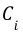
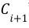

.. _rktoolkit.models:

Models package
========================

.. _rktoolkit.models.graph:

Graph Modules
-------------

.. automodule:: rktoolkit.models.graph
   :members:
   :undoc-members:

.. _rktoolkit.models.linkage:

Linkage functions
-----------------

.. autoclass:: rktoolkit.models.linkage.LinkageFunction
    :members:
    :undoc-members:

.. _rktoolkit.models.functions:

Functions for Manipulating Models
---------------------------------

.. automodule:: rktoolkit.models.functions
   :members:
   :undoc-members:

.. _rktoolkit.models.rkmodel:

R-K Model Module
----------------
An R-K Model is the fundamental building block of any R-K Diagram. It represents a composite object that can be used to render an R-K Diagram using appropriate filter and linker functions as defined according to the specific use-case. In other words, an R-K Diagram is the rendering of an R-K Model, and the R-K Model serves as the underlying data structure for that render.

All R-K Models must contain the following 3 components:

1. Structural Graph
2. Node Masks
3. Derived Links

**Structural Graph**

The structural graph (S) is the base graph derived through the Hierarchical Embedding Function, also known as the structural graph. The structural graph provides the baseline ontological structure that forms the basis for all other transformations in the pipeline. Because node masks are reductive operations, the number of nodes in the structural graph represents the maximal number of nodes in the R-K Diagram such that :math: `|nodes| ∈ S >= |nodes| ∈ R − K Diagram`. 
The structural graph however does not represent that maximal number of edges. The number of possible edges in the R-K Diagram is bounded by the number of combinations of nodes in the structural graph.

.. automodule:: rktoolkit.models.rkmodel
   :members:
   :undoc-members:

.. _rktoolkit.models.pipeline:

R-K Pipeline Module
-------------------
An R-K Pipeline is a unidirectional pipeline that builds an R-K Model from an incoming dataset or data stream as a precursor to generate domain specific R-K Diagrams with appropriate “range-filters” and “leaf-linkers''. An R-K Pipeline, involves the process of transforming an NxM Tensor  with 3 or more independent physical/ontological variables into an R-K Model which can then be visualized as an R-K Diagram with the help of domain specific filter and linker functions.
At a base level, the R-K Pipeline can be understood as a Directed Acyclic Graph (DAG), which provides transformational components that result in a composite model we call an R-K Model. Transforms in an R-K Pipeline can be chained against each other, as long as egress from one component complies with the ingress specifications from another component. We can mathematically represent this with the following representation: |CRK| where |Ci| represents a pipeline component and the egress of |Ci| is compliant with a set of constraints imposed by |Ci1|'s ingress. There are a few novel concepts and objects within the pipeline as well as the entire pipeline itself, by virtue of its components and ordering, that provide a novel approach toward topological graph theory and data analysis.

.. |CRK| image:: ../../imgs/Pipe/Pipe1.jpg

The figure below demonstrates the various steps of an R-K Pipeline w.r.t. the data-flow as shown:

.. image:: ../../imgs/rk-flow.png
   :width: 600

Composed together are the following steps:

1. Preprocess Steps
2. Localization Algorithm
3. Hierarchical Feature Extraction Nodes
4. Filter Functions
5. Linkage Functions

Composed together, these independent component modules of the R-K Pipeline can be triggered in sequence to synthesize an R-K Model as a precursor to generating R-K Diagrams.

.. automodule:: rktoolkit.models.pipeline 
   :members:
   :undoc-members:

